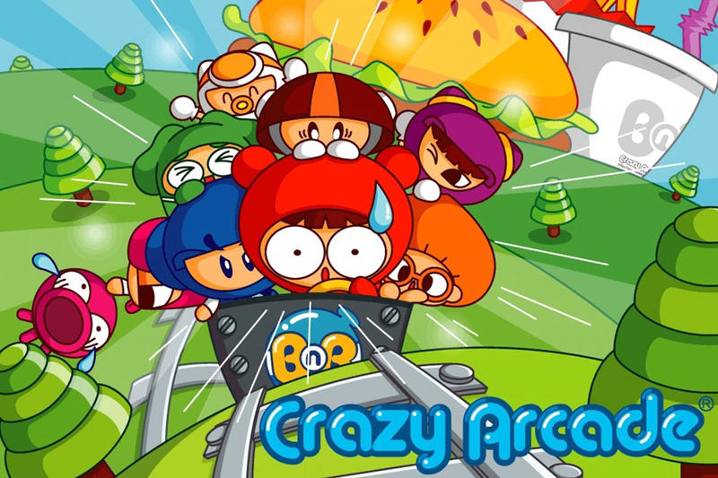
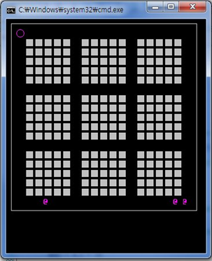
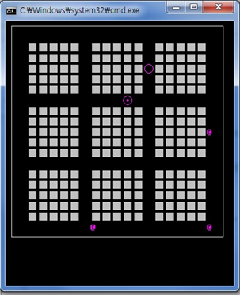
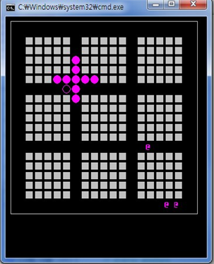
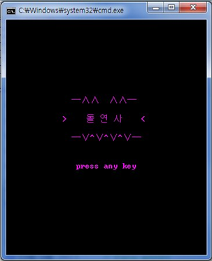
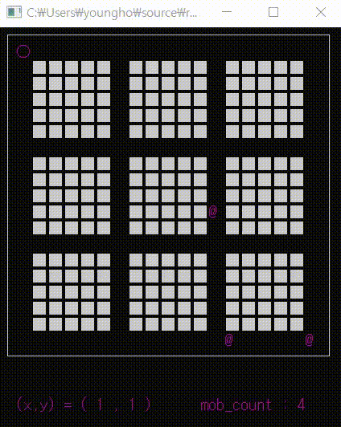

## 프로젝트명
미니 크레이지 아케이드 (개인 프로젝트)
## 사용언어
C
## 개발기간
2014.08 ~ 2014.11
## 프로젝트 소개
C언어로 구현한 콘솔창에서 동작하는 '크레이지 아케이드'의 미니 버전 구현

*****

## 실행화면

게임이 시작하였습니다. 제 캐릭터(○)와 적 캐릭터(@)가 생성되었습니다.

스페이스바를 누르면 사용자 캐릭터가 있던 자리에 물풍선(⊙)이 생깁니다.

일정 시간이 지나면 물풍선이 터집니다. 이때 물줄기에 맞은 벽돌들은 사라집니다.

사용자 캐릭터가 물줄기에 맞거나 적에게 닿으면 게임이 종료됩니다.

